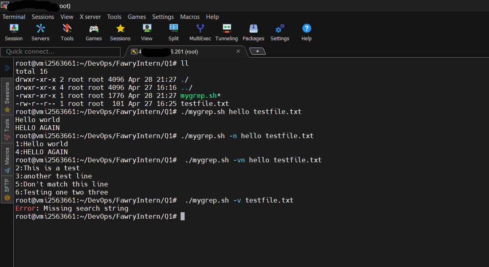

# mygrep.sh

A simple Bash implementation of basic grep functionality: case-insensitive search, line numbers, inverted match, and help.

## Installation

1. Clone or download this repository.
2. Make the script executable:
   ```bash
   chmod +x mygrep.sh
   ```

## Usage

```bash
./mygrep.sh [OPTIONS] PATTERN testfile.txt
```

- `PATTERN`: String to search (case-insensitive).
- `testfile.txt`: Text file to search.

### Options

- `-n`  Show line numbers for each match.
- `-v`  Invert match (show non-matching lines).
- `--help`  Display usage information.

Options can be combined, e.g. `-vn` or `-nv`.

## Examples (screenshots)

Place your terminal screenshot files in a separate `screenshots/` folder. Below are placeholder references; use actual filenames when adding images:

1. `./mygrep.sh hello testfile.txt`
2. `./mygrep.sh -n hello testfile.txt`
3. `./mygrep.sh -vn hello testfile.txt`
4. `./mygrep.sh -v testfile.txt`


## Reflective Section

### 1. Argument & Option Handling

The script uses Bash’s `getopts` to parse `-n` and `-v` flags and manually checks for `--help`. Parsed options are shifted out so that the first two positional parameters become the search pattern and file. It distinguishes missing-pattern errors by checking if exactly one argument remains and it corresponds to an existing file.

### 2. Extending to Regex or Additional Flags

To support regex (`-E`), case-sensitive toggle (`-i`), count matches (`-c`), or list filenames (`-l`), I would refactor parsing to include those flags in `getopts`, then switch from simple substring tests to Bash’s `=~` operator for regex. I would aggregate results in variables (e.g., counters, filename lists) and print summaries after processing.

### 3. Hardest Part

Coordinating inverted matching (`-v`) with line numbering (`-n`) to match GNU grep’s exact formatting was the trickiest. Ensuring error messages accurately distinguish between missing patterns and missing files added additional edge-case logic.

---

*End of README.md*

